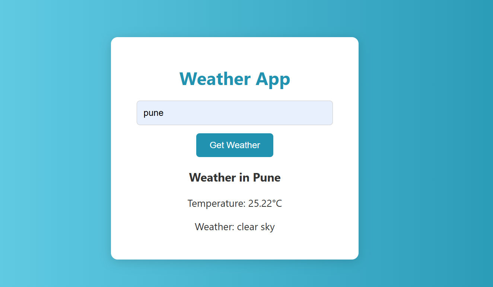

# 🌦️ Weather App (Dockerized)

A simple weather app using HTML, CSS, JavaScript, and Node.js.

## 🚀 Features
- Search weather by city
- Real-time temperature
- Docker support

## 🛠️ Tech Stack
- HTML, CSS, JS
- Node.js, Express
- Docker

## 🐳 Run with Docker
docker run -d -p 3000:3000 -e API_KEY=your_api_key abhishekp12/weather-app

## 📸 Screenshot

## 👨‍💻 Author
Abhishek Pandey